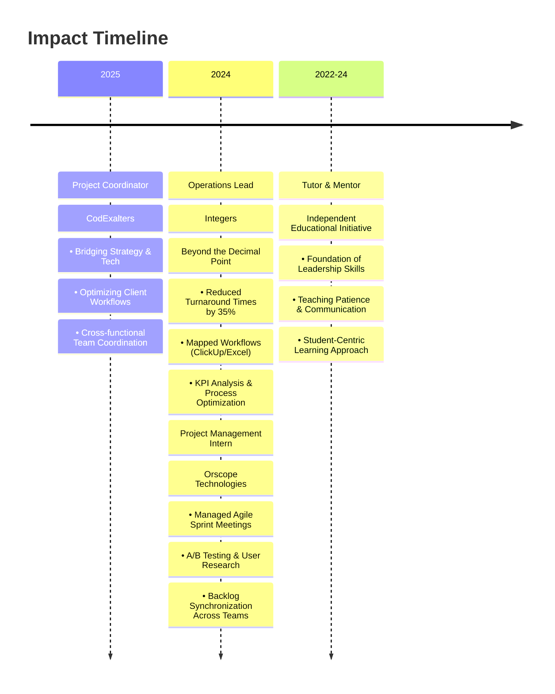

# 👋 Hello World! I'm Devrajsinh Gohil

<div align="center">
  
</div>

<div align="center">
  
</div>

---

## 🌐 Connect With Me

<div align="center">
  <a href="https://devrajsinh-portfolio.web.app/" target="_blank">
    
  </a>
  <a href="https://linkedin.com/in/devrajsinh2012" target="_blank">
    
  </a>
  <a href="https://x.com/devrajsinh2012" target="_blank">
    
  </a>
  <a href="mailto:djgohil2012@gmail.com">
    
  </a>
  <a href="https://www.coursera.org/learner/devrajsinh-gohil-2012" target="_blank">
    
  </a>
  <a href="https://www.credly.com/users/devrajsinh2012" target="_blank">
    
  </a>
</div>


---

## 🚀 About Me

<div align="center">
  
</div>

*"Technology is just a language. My goal is to be the translator who uses it to build bridges between complex systems and the people who use them."*
--- 

```yaml
🎯 Profile:
  name: "Devrajsinh Gohil"
  role: "Project Coordinator at codExalters"
  location: "Ahmedabad, Gujarat, India 🇮🇳"
  
💡 Superpower:
  - Translating 'Dev-Speak' to Business Goals
  - Operational Process Optimization (The 'How')
  - Empowering Teams through Mentorship & Guidance
  - AI Emerging Technology Integration  
  - Agile & Data-Driven Product Delivery
  - Cross-functional Team Leadership
  
🎨 Philosophy:
  - "Empathy-led design creates lasting impact"
  - "Business-aligned tech drives growth"
  - "Continuous iteration breeds improvement"

❤️ Passion:
  - Teaching & Educational Leadership
  - Tech for Good (Social Impact Projects)
  - Continuous Learning (Aspire & McKinsey Alumni)
  
```

<div align="center">
  
---
### 🌟 Leadership & Strategy (My Core)
<div align="left">
  
- 🏛️ **Aspire Leadership Program** - *Harvard Business School Curriculum*
- 🚀 **McKinsey Forward Program** - *Problem Solving, Resilience & Adaptability*
- 🎯 **Google Project Management Specialization** - *Agile & Scrum Methodologies*
- 💼 **Career Essentials in Business Analysis** - *Microsoft & LinkedIn*
- 🎨 **Google UX Design Professional Certificate** - *Human-Centered Design*
- 📈 **Google Digital Marketing & E-commerce** - *Growth & Conversion Strategies*

</div>

### 📊 Data & Technical Foundations (My Tools)
<div align="left">
  
- 📈 **Google Data Analytics Specialization** - *Making Data Speak*
- 💼 **Google Business Intelligence** - *Strategic Decision Making*
- 🐍 **Python Data Structures** - *University of Michigan*
- 🤖 **Google AI Essentials** - *Future-Proofing Workflows*
- ☁️ **Microsoft Azure Fundamentals** - *Cloud Infrastructure*
- 🔬 **IBM Enterprise Data Science** - *Advanced Analytics*

</div>

### 🌐 Technical Certifications
<div align="left">
  
- 🌐 **CCNA: Introduction to Networks** - *Cisco Networking Foundations*
- 🔧 **CCNA: Switching, Routing & Wireless Essentials** - *Network Infrastructure*
- 🐧 **NDG Linux Essentials** - *System Administration*
- 🤖 **Machine Learning with Scikit-Learn** - *ML Implementation*

</div>

---
## 🛠️ The Toolkit

<div align="center">
  
</div>

### 📋 Ops & Management (My Happy Place)
<div align="center">
  
  
  
  
  
  
  
</div>

### 🎨 Design & Collaboration
<div align="center">
  
  
  
</div>

### 📊 Analysis & Tech (The Support System)
<div align="center">
  
  
  
  
  
  
</div>

### ☁️ Cloud & Infrastructure
<div align="center">
  
  
  
  
</div>

---

## 💼 Professional Journey


### 🎯 Key Impact Areas

<table>
<tr>
<td width="33%" valign="top">

**🔄 Operational Clarity**

At Integers, I didn't just track tasks—I analyzed operational logs to surface KPIs like queue length and process time, giving the team clear direction and actionable insights.

</td>
<td width="33%" valign="top">

**🤝 Agile Facilitation**

At Orscope, I synchronized backlogs between Research and Marketing teams to keep dependencies clear and people aligned, reducing blockers by 40%.

</td>
<td width="33%" valign="top">

**🌍 Tech for Good**

Published IEEE research on Gujarati Sign Language Recognition to help bridge communication gaps using technology and AI.

</td>
</tr>
</table>

---

## 🔍 Current Exploration

<div align="center">
  
</div>

<table align="center">
<tr>
<td align="center" width="50%">

### 🚀 Operational Excellence
- 🤖 **AI-Driven Process Improvement**
- 📊 **Business Intelligence Strategies**
- 🎯 **Stakeholder Psychology & Management**
- 🔄 **Scalable Workflow Design**
- 📈 **Data-Driven Decision Making**

</td>
<td align="center" width="50%">

### 🎨 Human-Centric Growth
- 🧠 **Mentorship & Coaching Programs**
- 📈 **Data Storytelling Techniques**
- 🔍 **Social Impact Technology**
- 💡 **Community Building Initiatives**
- 🌱 **Sustainable Growth Strategies**

</td>
</tr>
</table>

### 🌟 Current Focus Areas
- [ ] **Advanced Operational Analytics** - Leveraging AI for workflow optimization
- [ ] **Leadership Development** - Building high-performing, empowered teams
- [ ] **Tech for Social Impact** - Creating solutions that matter
- [ ] **Process Automation** - Reducing manual work, increasing efficiency

---

## 🤝 Let's Build Together!

<div align="center">
  
</div>

### 💬 I'm Open To Discussing:
- 🚀 **How to optimize your startup's operations**
- 🤖 **Leveraging AI for business efficiency**
- 📊 **Teaching & Educational Initiatives**
- 👥 **Connecting people with the right tech solutions**
- 🎯 **Strategic project coordination and team leadership**
- 🌍 **Tech for social good and impact projects**
  
### 📞 Get In Touch:
<div align="center">
  <a href="https://linkedin.com/in/devrajsinh2012" target="_blank">
    
  </a>
  <a href="https://devrajsinh-portfolio.web.app/" target="_blank">
    
  </a>
  <a href="mailto:djgohil2012@gmail.com">
    
  </a>
</div>

---  
  
### 💭 My Philosophy
  
*"Efficiency isn't about working harder. It's about clearing the clutter so people can do their best work."*

---

</div>

<div align="center">
  
  
  **✨ Let's build a better future, together! ✨**
  
  
  

---

<div align="center">
  
</div>
