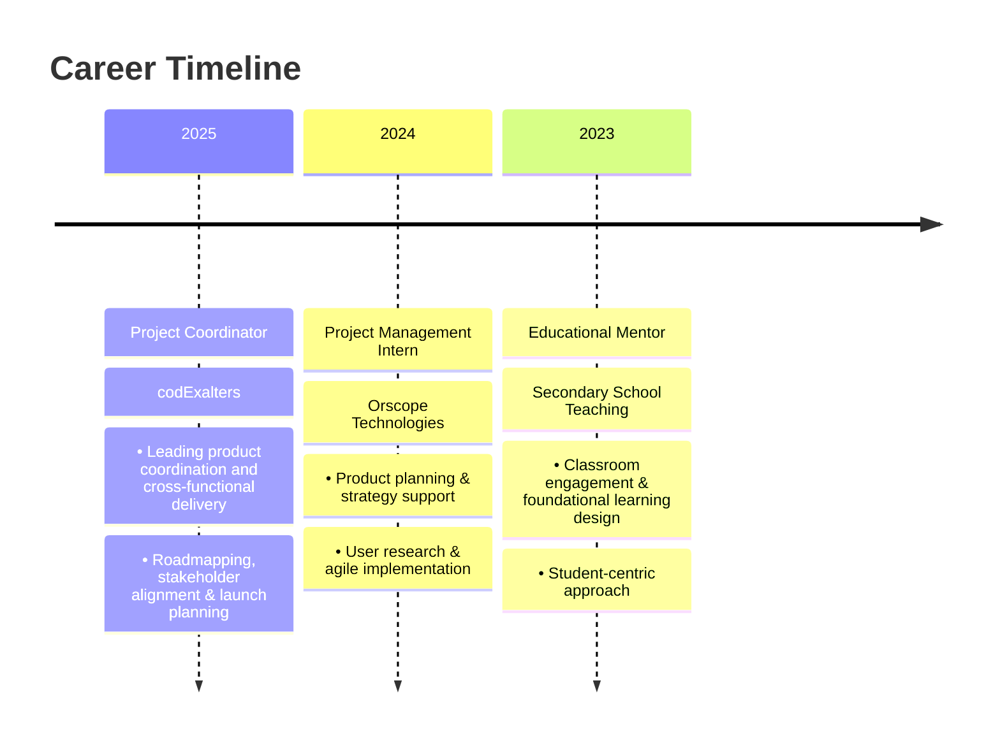

# 👋 Hello World! I'm Devrajsinh Gohil

<div align="center">
  
</div>

<div align="center">
  
</div>

---

## 🌐 Connect With Me

<div align="center">
  <a href="https://devrajsinh-portfolio.web.app/" target="_blank">
    
  </a>
  <a href="https://linkedin.com/in/devrajsinh2012" target="_blank">
    
  </a>
  <a href="https://x.com/devrajsinh2012" target="_blank">
    
  </a>
  <a href="mailto:djgohil2012@gmail.com">
    
  </a>
  <a href="https://www.coursera.org/learner/devrajsinh-gohil-2012" target="_blank">
    
  </a>
  <a href="https://www.credly.com/users/devrajsinh2012" target="_blank">
    
  </a>
</div>

---

## 🚀 About Me

<div align="center">
  
</div>

```yaml
🎯 Profile:
  name: "Devrajsinh Gohil"
  role: "Project Coordinator at codExalters"
  location: "Ahmedabad, Gujarat, India 🇮🇳"
  
💡 Expertise:
  - Strategic Product Thinking & Roadmapping
  - AI, AGI & Emerging Technology Integration  
  - User Research & UX Strategy
  - Agile & Data-Driven Product Delivery
  - Cross-functional Team Leadership
  
🎨 Philosophy:
  - "Empathy-led design creates lasting impact"
  - "Business-aligned tech drives growth"
  - "Continuous iteration breeds improvement"
  
📊 Current Focus:
  - Product-Led Growth Strategies
  - AI-Augmented Research
  - Data-Driven Decision Making
```

<div align="center">
  
---

## 🎓 Professional Certifications

<div align="center">
  
</div>

### 🌟 Google Certified Professional
<div align="left">
  
- 🎯 **Google Project Management Specialization** - *Advanced PM Methodologies*
- 📊 **Google Data Analytics Specialization** - *Business Intelligence & Insights*
- 🤖 **Google AI Prompting Essentials** - *Next-Gen AI Integration*
- 🎨 **Google UX Design Professional Certificate** - *Human-Centered Design*
- 📈 **Google Digital Marketing & E-commerce** - *Growth & Conversion*
- 💼 **Google Business Intelligence** - *Strategic Data Analysis*

</div>

### 🏢 IBM Enterprise Certified
<div align="left">
  
- 🔬 **IBM: Getting Started with Enterprise Data Science**
- 🚀 **IBM: Enterprise Data Science in Practice**

</div>

### 🌐 Technical Certifications
<div align="left">
  
- 🌐 **CCNA: Introduction to Networks** - *Cisco Networking*
- 🔧 **CCNA: Switching, Routing & Wireless Essentials**
- ☁️ **AWS Academy Cloud Foundations** - *Cloud Architecture*
- 🐧 **NDG Linux Essentials** - *System Administration*
- 🐍 **Python Data Structures** - *University of Michigan*
- 🤖 **Machine Learning with Scikit-Learn** - *ML Implementation*

</div>

---

## 🛠️ Technology Arsenal

<div align="center">
  
</div>

### 📋 Product & Project Management
<div align="center">
  
  
  
  
  
</div>

### 🎨 Design & Creativity
<div align="center">
  
  
  
  
</div>

### 📊 Data Analytics & Intelligence
<div align="center">
  
  
  
  
  
  
</div>

### ☁️ Cloud & Infrastructure
<div align="center">
  
  
  
  
</div>

---

## 💼 Professional Journey

<div align="center">
  
</div>



### 🎯 Key Achievements
- 🚀 **Led cross-functional teams** of 15+ members in product development
- 📈 **Increased user engagement** by 40% through data-driven insights
- 🎨 **Designed user experiences** that improved conversion rates by 25%
- 💡 **Implemented agile methodologies** reducing development cycles by 30%

---

## 🔍 Current Exploration

<div align="center">
  
</div>

<table align="center">
<tr>
<td align="center" width="50%">

### 🚀 Product Innovation
- 🤖 **AI-Augmented Product Strategy**
- 📊 **Product-Led Growth Models**
- 🎯 **OKR Implementation & Tracking**
- 🔄 **Advanced Agile Frameworks**

</td>
<td align="center" width="50%">

### 🎨 User Experience
- 🧠 **Behavioral Product Design**
- 📈 **Data Storytelling Techniques**
- 🔍 **Advanced User Research Methods**
- 💡 **Design Systems & Standards**

</td>
</tr>
</table>

### 🌟 Learning Goals for 2025
- [ ] **Advanced Product Analytics** - Mastering conversion funnel optimization
- [ ] **AI Product Management** - Building AI-first product strategies  
- [ ] **Leadership Excellence** - Scaling high-performing product teams
- [ ] **Growth Hacking** - Implementing viral product features

---

## 🤝 Let's Build Together!

<div align="center">
  
</div>

### 💬 I'd Love to Discuss:
- 🚀 **Product Strategy & Roadmapping**
- 🤖 **AI Integration in Products**
- 📊 **Data-Driven Decision Making**
- 👥 **Team Leadership & Culture**
- 🎯 **User-Centric Innovation**

### 📞 Get In Touch:
<div align="center">
  <a href="https://linkedin.com/in/devrajsinh2012" target="_blank">
    
  </a>
  <a href="https://devrajsinh-portfolio.web.app/" target="_blank">
    
  </a>
  <a href="mailto:djgohil2012@gmail.com">
    
  </a>
</div>

---  
### 💭 My Product Philosophy
  
*"A great product manager isn't just a feature factory. They're the voice of the user, the architect of strategy, and the heartbeat of innovation."*

</div>

<div align="center">
  
  
  **✨ Let's build the future, one product decision at a time! ✨**
  
  
</div>

---

<div align="center">
  
</div>
